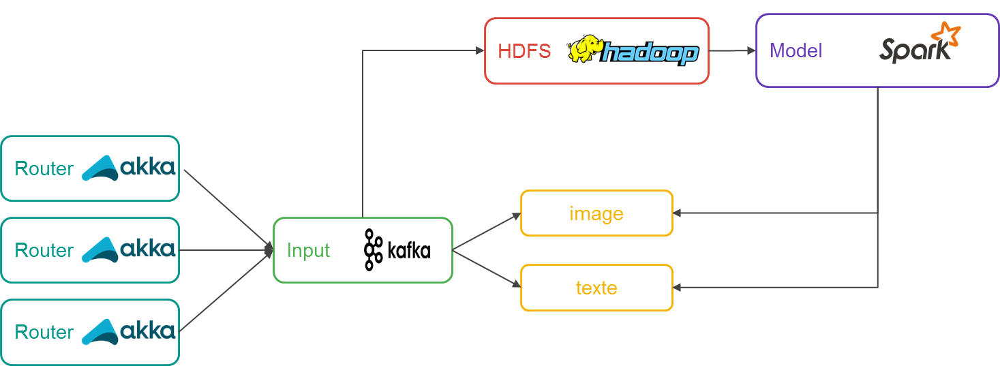

# Sophia

Sophia is a system who will allow you to use several model.

## Definition

Based on the SMACK architecture, Sophia want to provide several data model for users.

### Akka

The akka workers in the image are designed to route http request to the proper model.
For example, a POST request asking for image classification with data inside.

### Spark

The Spark technology will be used to provide batch processing in order to refresh model. 
The new model will be push to the micro-service associated (that's the initial vision of the project from now...).

### Micro-service
Micro-service are designed for asking about classification request or more. The future below would be to adding new akka route to make an aggregation of classification answer.

## How it work

Sophia provide api design to manage you services : 

#### Service management
* /list to list all the services available.
* /addService to register a service to the project.
* /getService provide a service given the specific name.
#### HDFS
It's possible to push your data in a HDFS cluster through :
* /push 

you can use it like : 

    curl --form "data=@path/to/file" http://localhost:8080/push
